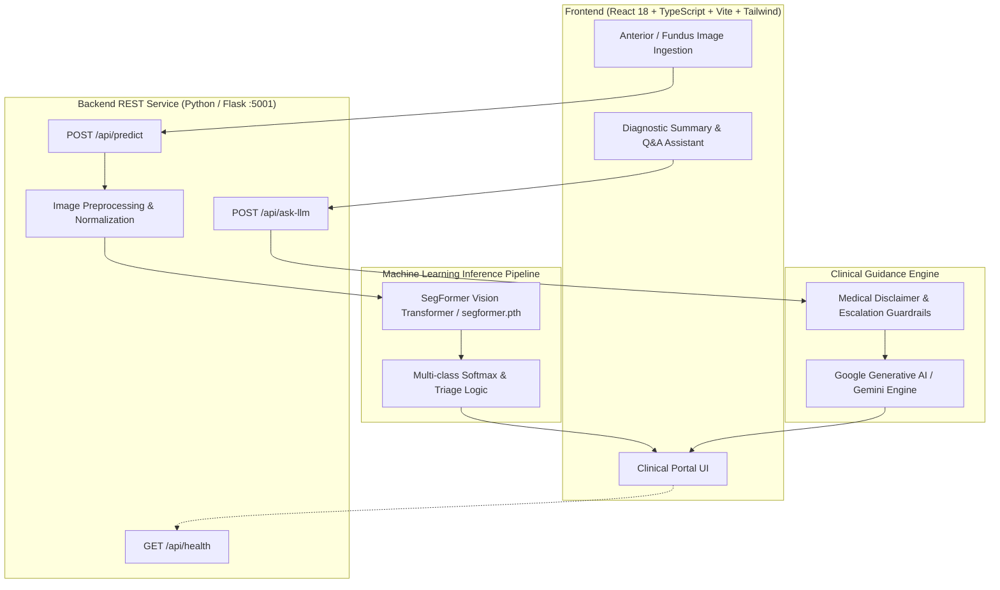

<div align="center">

# 👁️ VitalArc
### AI-Assisted Ophthalmic Screening & Clinical Decision Support System (CDSS) Prototype

[](https://github.com/SHREESABARI-5143/VitalArc/actions/workflows/ci.yml)
[](https://github.com/SHREESABARI-5143/VitalArc/actions/workflows/codeql.yml)
[](https://opensource.org/licenses/MIT)
[](https://www.python.org/)
[](https://www.typescriptlang.org/)
[](https://react.dev/)
[](https://www.docker.com/)

[System Overview](#-system-overview) • [Architecture](#-system-architecture) • [Verified Capabilities](#-verified-capabilities) • [API Specification](#-verified-api-specification) • [Local Setup](#-local-development-setup) • [Docker](#-docker-orchestration) • [Verification & Testing](#-testing--quality-gate)

</div>

---

> ⚠️ **MEDICAL & CLINICAL DISCLAIMER**:  
> **VitalArc is a research and clinical decision-support prototype** designed for preliminary screening assistance and investigational decision support. **It does not provide definitive medical diagnoses, guarantee clinical outcomes, or replace the expertise, examination, or clinical judgment of a licensed ophthalmologist or healthcare provider.** All screening observations must be evaluated by a certified medical specialist.

---

## 📌 System Overview

**VitalArc** is an end-to-end clinical decision-support system (CDSS) prototype engineered to assist clinical workflows in evaluating anterior segment and retinal ocular conditions. 

The platform combines:
1. **Deep Vision Image Classification**: Transformer-based vision classification (`SegformerForImageClassification`) for anterior segment ocular condition evaluation.
2. **Clinical Copilot Assistant**: Contextual medical assistance powered by Google Generative AI with clinical guidance and medical disclaimer enforcement.
3. **Clinical Web Portal**: A responsive React 18 & TypeScript frontend providing image upload, real-time confidence scores, clinical triage recommendations, and structured patient screening reports.

---

## 🏗️ System Architecture



---

## ✨ Verified Capabilities

- **Anterior Segment Ocular Screening**: Evaluates anterior eye images against trained target classes (`Conjunctivitis`, `Pterygium`).
- **Probabilistic Severity Triage**: Maps softmax confidence scores to clinical urgency tiers (`High`, `Moderate`, `Low`) with condition-specific referral guidance.
- **Interactive Clinical Q&A**: Answers patient questions about symptoms, contagiousness, and referral urgency with strict professional disclaimer enforcement.
- **Local Storage Audit Trail**: Tracks and persists recent screening sessions for patient record review.
- **Enterprise Monorepo Engineering**: Clean separation of frontend client, backend REST services, ML pipeline modules, and RAG evaluation suites.

---

## 🛠️ Technology Stack

| Subsystem | Technology | Purpose |
| :--- | :--- | :--- |
| **Frontend UI** | React 18, TypeScript 5.5, Vite 5, Tailwind CSS | Clinical practitioner user interface |
| **Icons & Design** | Lucide React, Modern CSS Design Tokens | Medical dashboard visualization |
| **Backend API** | Python 3.10+, Flask 2.3, Flask-CORS | REST API gateway on port `5001` |
| **Deep Learning** | PyTorch, Hugging Face Transformers (`Segformer`) | Vision transformer image classification |
| **Image Processing** | Pillow (PIL), Torchvision Transforms | Image resizing (224x224) and ImageNet normalization |
| **Clinical GenAI** | Google Generative AI (`gemini-flash-latest`) | Clinical reasoning and patient FAQ copilot |
| **Security & Quality** | GitHub Actions CI, CodeQL, Flake8, Python Unittest | Automated security scanning and static analysis |

---

## 📡 Verified API Specification

### 1. Service Health Check
```http
GET /api/health
```
**Response (200 OK):**
```json
{
  "status": "healthy",
  "service": "VitalArc Diagnostic API",
  "version": "1.0.0",
  "model_loaded": true,
  "classes": ["Conjunctivitis", "Pterygium"],
  "llm_configured": true
}
```

---

### 2. Ocular Image Screening
```http
POST /api/predict
Content-Type: multipart/form-data  (or application/json with base64)
```
**Request:**
- `file`: Image binary (JPEG, PNG, WebP) **OR**
- `image`: Base64 data URI string (`data:image/jpeg;base64,...`)

**Response (200 OK):**
```json
{
  "primaryDiagnosis": "Conjunctivitis",
  "confidence": 94.2,
  "predictions": [
    {
      "disease": "Conjunctivitis",
      "confidence": 94.2,
      "severity": "High"
    },
    {
      "disease": "Pterygium",
      "confidence": 5.8,
      "severity": "Low"
    }
  ],
  "recommendation": "Schedule appointment with eye doctor for proper diagnosis and treatment.",
  "processingTime": 0.05,
  "message": "Analysis completed successfully"
}
```

---

### 3. Clinical Copilot Q&A
```http
POST /api/ask-llm
Content-Type: application/json
```
**Request:**
```json
{
  "question": "Is this condition contagious?",
  "diagnosis": "Conjunctivitis",
  "confidence": 94.2,
  "recommendation": "Schedule appointment with eye doctor."
}
```
**Response (200 OK):**
```json
{
  "answer": "• Viral and bacterial conjunctivitis are highly contagious...\n• Avoid touching your eyes and wash hands frequently.\n• Please consult a licensed eye doctor for definitive medical evaluation."
}
```

---

## 🚀 Local Development Setup

### Prerequisites
- **Node.js** >= 18.x
- **Python** >= 3.10.x
- **Git**

### 1. Clone & Configure Environment
```bash
git clone https://github.com/SHREESABARI-5143/VitalArc.git
cd VitalArc

# Copy environment configuration
cp .env.example .env
```
Configure your `GEMINI_API_KEY` in `.env` if using the clinical assistant copilot.

---

### 2. Backend Service Setup
```bash
cd backend
python -m venv .venv

# On Windows:
.venv\Scripts\activate
# On Linux / macOS:
# source .venv/bin/activate

pip install -r requirements.txt
python app.py
```
*Backend runs on `http://localhost:5001`.*

---

### 3. Frontend Web Client Setup
```bash
# In the repository root directory
npm install
npm run dev
```
*Frontend runs on `http://localhost:5173`.*

---

## 🐳 Docker Orchestration

Run both frontend and backend in isolated containers:

```bash
docker compose up --build
```
- **Web App**: `http://localhost:5173`
- **Backend API**: `http://localhost:5001`

---

## 🧪 Testing & Quality Gate

```bash
# Frontend static type checking
npm run typecheck

# Frontend ESLint verification
npm run lint

# Frontend production bundle build
npm run build

# Backend unit test suite
python -m unittest discover backend/tests -v
```

---

## 📊 Model Evaluation & Benchmarks

| Parameter | Specification | Verification Status |
| :--- | :--- | :--- |
| **Model Architecture** | `SegformerForImageClassification` | Verified in `backend/app.py` |
| **Weights Checkpoint** | `segformer.pth` (13.3 MB) | Verified in `backend/` |
| **Input Dimensions** | `(3, 224, 224)` RGB | Verified in `transforms.py` |
| **Output Classes** | `Conjunctivitis`, `Pterygium` | Verified in `app.py` state dict |
| **Benchmark Metrics (Accuracy / F1 / AUC)** | *Standardized Multi-Center Evaluation* | **To be verified on holdout clinical test set** |

---

## 🔒 Security Configuration

- **Zero Hardcoded Secrets**: Secrets and API tokens are strictly loaded via `.env` and environment variables.
- **CodeQL Scanning**: Automated static application security testing enabled in `.github/workflows/codeql.yml`.
- **Pre-commit Hooks**: Enforces clean formatting, syntax validity, and size limits via `.pre-commit-config.yaml`.
- **Vulnerability Reporting**: See [`SECURITY.md`](SECURITY.md) for reporting guidelines.

---

## 📜 License

Distributed under the **MIT License**. See [`LICENSE`](LICENSE) for complete details.