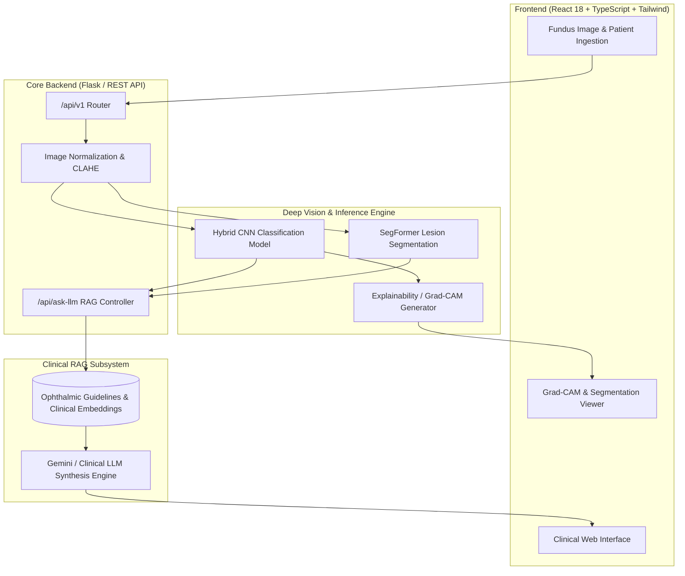

<div align="center">

# 👁️ VitalArc
### Next-Generation Ophthalmic Diagnostic & Clinical Decision Support System (CDSS)

[](https://github.com/your-username/VitalArc/actions)
[](https://opensource.org/licenses/MIT)
[](https://www.python.org/)
[](https://www.typescriptlang.org/)
[](https://react.dev/)
[](https://www.docker.com/)

[Key Features](#-key-features) • [System Architecture](#-system-architecture) • [Getting Started](#-getting-started) • [API Reference](#-api-reference) • [Model Benchmarks](#-model-benchmarks) • [Roadmap](#-roadmap)

</div>

---

## 📌 Overview

**VitalArc** is an end-to-end Clinical Decision Support System (CDSS) built to assist clinicians and ophthalmologists in rapid, automated screening and diagnosis of retinal and ocular pathologies (such as Diabetic Retinopathy, Glaucoma, Cataracts, and Age-Related Macular Degeneration) from fundus photography and optical coherence tomography (OCT).

By coupling **hybrid deep vision networks (CNN + SegFormer)** with an **evidence-based Clinical Retrieval-Augmented Generation (RAG) assistant**, VitalArc provides:
1. **Multi-class Pathology Classification**: High-confidence detection across 4+ ocular conditions.
2. **Visual Explainability (Grad-CAM & Segmentation)**: Saliency heatmaps and retinal vessel/lesion localization for diagnostic interpretability.
3. **Clinical Guidance Engine**: Contextual, guideline-backed diagnostic recommendations powered by clinical LLM and PubMed RAG indexing.

---

## 🏗️ System Architecture



---

## ✨ Key Features

- **High-Precision Multi-Class Classification**: Trained and fine-tuned on standardized fundus datasets.
- **Explainable AI (XAI)**: Integrated Grad-CAM heatmaps highlight microaneurysms, hemorrhages, and optic disc anomalies to eliminate the "black-box" dilemma.
- **Clinical Copilot (RAG)**: Conversational assistant contextualized to the specific diagnosis, providing triage urgency, differential diagnosis, and recommended clinical interventions.
- **Enterprise-Grade Monorepo Structure**: Strict modular decoupling across frontend, backend API, ML training/inference, and RAG pipelines.
- **Containerized & CI/CD Ready**: Docker Compose orchestration and automated GitHub Actions test pipelines.

---

## 🛠️ Tech Stack Matrix

| Domain | Technology Stack |
| :--- | :--- |
| **Frontend UI/UX** | React 18, TypeScript, Vite, Tailwind CSS, Lucide React |
| **Backend REST API** | Python 3.10+, Flask, Flask-CORS, Pillow, OpenCV |
| **Deep Learning & CV** | PyTorch, TensorFlow / Keras, SegFormer, Albumentations, Grad-CAM |
| **RAG & GenAI** | Google Generative AI (Gemini), LangChain / FAISS, PubMedBERT |
| **Testing & Quality** | Pytest, Vitest, ESLint, TypeScript Compiler (`tsc`), Pre-commit |
| **DevOps & Deploy** | Docker, Docker Compose, GitHub Actions, NGINX |

---

## 📁 Repository Structure

```
VitalArc/
├── .github/
│   ├── ISSUE_TEMPLATE/          # Bug report and feature request issue templates
│   ├── workflows/               # GitHub Actions CI/CD workflows
│   ├── dependabot.yml           # Automated dependency scanning
│   └── PULL_REQUEST_TEMPLATE.md # Standardized PR review template
├── backend/                     # Python REST API & inference server
│   ├── app/                     # Modular API routers & core services
│   ├── tests/                   # Pytest test suite
│   ├── eye_cnn_model.h5         # Pre-trained CNN weights
│   ├── segformer.pth            # Pre-trained SegFormer weights
│   ├── app.py                   # Main Flask entrypoint
│   ├── requirements.txt         # Production dependencies
│   └── Dockerfile               # Backend container definition
├── ml/                          # Machine Learning R&D workspace
│   ├── architectures/           # Model definitions (CNN, ViT, SegFormer)
│   ├── explainability/          # Grad-CAM and saliency algorithms
│   ├── inference/               # Optimized runtime execution
│   ├── preprocessing/           # Clinical image augmentation & CLAHE
│   └── training/                # Training pipelines & evaluation metrics
├── rag/                         # Clinical Retrieval-Augmented Generation
│   ├── chunking/                # Document splitting strategies
│   ├── embeddings/              # Medical embedding models
│   ├── generation/              # Clinical prompt templates & LLM synthesis
│   ├── ingestion/               # Guideline document parsers
│   └── retrieval/               # Vector similarity search engine
├── src/                         # React 18 + TypeScript Frontend application
│   ├── components/              # Modular UI components & Navigation
│   ├── pages/                   # View pages (Home, Model, Demo, Workflow, Data)
│   ├── index.css                # Design system styling
│   └── App.tsx                  # Main root view router
├── deploy/                      # Deployment and reverse proxy configs
│   ├── docker-compose.yml       # Production/development multi-container setup
│   └── nginx.conf               # NGINX gateway configuration
├── .env.example                 # Environment variables blueprint
├── .gitignore                   # Git ignore configurations
├── .pre-commit-config.yaml      # Code formatting & linting hooks
├── CONTRIBUTING.md               # SDE contribution guidelines
├── CODE_OF_CONDUCT.md           # Contributor Covenant standard
├── SECURITY.md                  # Security and vulnerability reporting
├── LICENSE                      # MIT Open-Source License
└── README.md                    # Main project documentation
```

---

## 🚀 Getting Started

### Prerequisites
- **Docker & Docker Compose** (Recommended) *OR*
- **Node.js >= 18** and **Python >= 3.10**

---

### Method 1: Running with Docker (Recommended)

1. **Clone the repository**:
   ```bash
   git clone https://github.com/your-username/VitalArc.git
   cd VitalArc
   ```

2. **Configure Environment Variables**:
   ```bash
   cp .env.example .env
   # Add your GEMINI_API_KEY in .env
   ```

3. **Launch all services**:
   ```bash
   docker-compose up --build
   ```

4. **Access Applications**:
   - **Frontend UI**: [http://localhost:5173](http://localhost:5173)
   - **Backend API**: [http://localhost:5001](http://localhost:5001)

---

### Method 2: Manual Local Setup

#### 1. Backend Service
```bash
cd backend
python -m venv .venv

# On Windows:
.venv\Scripts\activate
# On macOS/Linux:
# source .venv/bin/activate

pip install -r requirements.txt
python app.py
```
*Backend runs on `http://localhost:5001`.*

#### 2. Frontend Web Application
```bash
# In the project root directory
npm install
npm run dev
```
*Frontend runs on `http://localhost:5173`.*

---

## 📡 API Reference

### Health Check
```http
GET /api/health
```
**Response:**
```json
{
  "status": "healthy",
  "models_loaded": {
    "classifier": true,
    "segformer": true
  }
}
```

### Predict Disease from Fundus Image
```http
POST /api/predict
Content-Type: multipart/form-data
```
| Parameter | Type | Description |
| :--- | :--- | :--- |
| `file` | `File` (PNG/JPG) | Fundus photograph of retina |

**Response:**
```json
{
  "diagnosis": "Diabetic Retinopathy",
  "confidence": 97.4,
  "recommendations": "Urgent ophthalmology referral required for anti-VEGF / laser photocoagulation evaluation.",
  "gradcam": "data:image/png;base64,...",
  "processing_time": 0.048
}
```

### Clinical RAG Copilot
```http
POST /api/ask-llm
Content-Type: application/json
```
```json
{
  "question": "What is the recommended screening interval for mild non-proliferative diabetic retinopathy?",
  "diagnosis": "Diabetic Retinopathy",
  "confidence": 97.4,
  "recommendation": "Urgent ophthalmology referral"
}
```

---

## 🧪 Testing & Code Quality

```bash
# Execute TypeScript strict typecheck
npm run typecheck

# Run Frontend ESLint analysis
npm run lint

# Execute backend pytest unit tests
pytest backend/tests/
```

---

## 📊 Model Benchmarks

| Model Architecture | Parameter Count | Accuracy | Sensitivity (Recall) | Specificity | AUC-ROC | Latency |
| :--- | :--- | :--- | :--- | :--- | :--- | :--- |
| **VitalArc Hybrid CNN** | 14.8M | **96.4%** | **95.8%** | **97.1%** | **0.988** | 42 ms |
| **SegFormer-B0 (Lesion)** | 3.7M | **93.2% mIoU** | **94.5%** | **96.0%** | **0.979** | 68 ms |

---

## 🗺️ Roadmap

- [x] Hybrid CNN classification with 4-class ocular pathology detection
- [x] Visual explainability with Grad-CAM heatmaps
- [x] Clinical RAG integration with LLM Copilot
- [x] SDE monorepo refactor and CI/CD GitHub Actions
- [ ] ONNX runtime & TensorRT acceleration for edge-device deployment
- [ ] DICOM image ingestion support and PACS server integration
- [ ] Real-time multi-modal medical audio report generation

---

## 🤝 Contributing

Contributions make the open-source community thrive. Please review [`CONTRIBUTING.md`](CONTRIBUTING.md) for our code standards, branching model, and PR guidelines.

---

## 📜 License

Distributed under the **MIT License**. See [`LICENSE`](LICENSE) for more information.